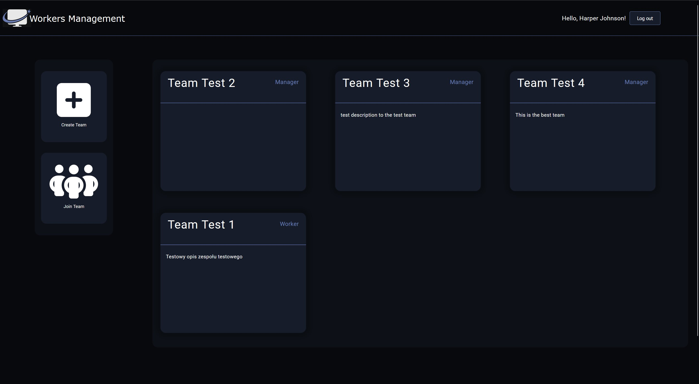
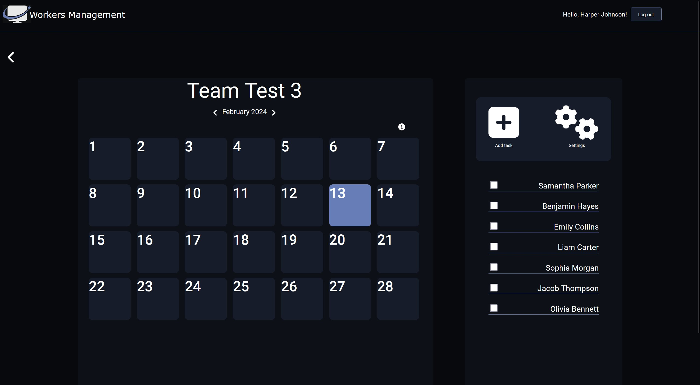
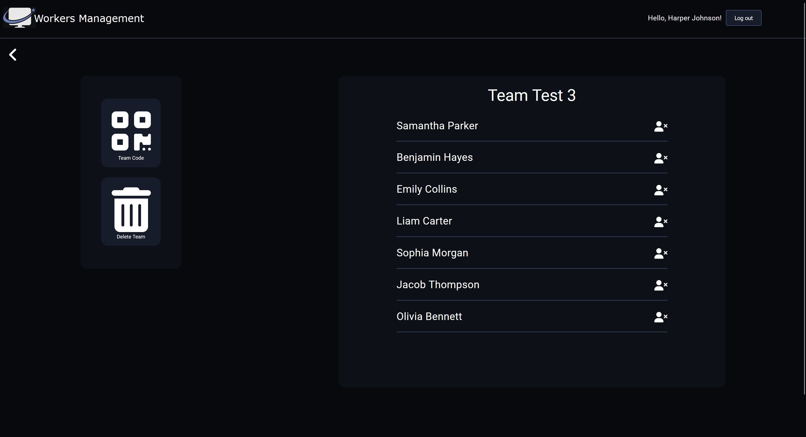

## Workers Management service

    The Workers Management project is a comprehensive web tool developed in
    technologies such as Django, Rest API, Angular. The goal of this project is
    enabling the company to manage resources efficiently through assignment
    tasks, creating teams and monitoring employee performance. Whole
    The user interface has been designed with ergonomics in mind
    modern look, inspired by Teams style.


## Features
- login and registration system
- email address verification
- CRUD team
- CRUD task
- leaving team
- joining team via unique code
- viewing the calendar for different months
- viewing tasks for the specified worker
- regenerate unique code


## 🛠 Built With
- TypeScript
- Angular
- HTML / CSS
- Django
- Rest Framework
- PostgreSQL
- Postman


## Installation

1. Clone the repo
```bash
git clone https://github.com/janmark101/ManagementWorkers.git
```

2. Create virtual environment

```bash
python -m venv <name-of-your-enviroment> 
```

* Activate the virtual environment:
Windows
```bash
.\name-of-your-enviroment\Scripts\activate
```
macOS/Linux
```bash
source name-of-your-enviroment/bin/activate
```

3. Next install all necesary libraries with this command :

```bash
pip install -r requirements.txt
```

4. Prepare the database : 
```bash
python manage.py migrate
```

5. Start the server :
```bash
python manage.py runserver
```
6. Start server for angular app : 
```bash
ng serve
```

Navigate to `http://localhost:4200/`.
Home page : 


Calendar : 


Team settings : 
